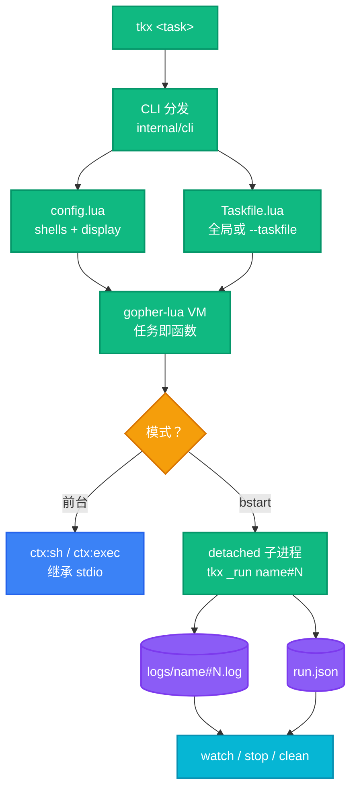

<div align="right">

[English](README.md) · [中文](README-zh.md)

</div>

<h1 align="center">tkx</h1>

<p align="center">
  <strong>现代任务运行器：Lua 任务文件 + 内置后台任务管理。</strong>
  <br />
  <em>真实代码而非 YAML · 全局任务 · 脱离终端的后台作业</em>
</p>

<p align="center">
  <a href="#快速开始"></a>
  <a href="docs/lua.md"></a>
  <a href="LICENSE"></a>
</p>

<p align="center">
  <a href="https://github.com/XiaTian-AC/taskx/releases"></a>
  <a href="https://github.com/XiaTian-AC/taskx/actions/workflows/release.yml"></a>
  <a href="LICENSE"></a>
</p>

<p align="center">
  
  
  
</p>

---

## 为什么选 tkx？

- ⚡ **任务就是真实代码** —— `Taskfile.lua` 里每个任务是 Lua 函数，条件判断、参数、互相调用全部原生支持，不用跟 YAML 较劲。
- 🌍 **全局任务** —— 在 `~/.config/taskx/Taskfile.lua` 定义一次，任何目录下都能跑。
- 🌙 **后台执行** —— `tkx bstart` 让任务脱离终端常驻，关掉窗口照常运行。
- 👀 **实时输出** —— `tkx watch` 实时查看任意后台任务的日志；Ctrl+C 只退出查看、不杀任务。
- 🔀 **多实例 + 安全门** —— 同名任务允许并发；tkx 提示冲突风险并在启动前让你确认。
- 🧩 **Shell 注册表** —— Windows 默认 pwsh、其他系统默认 bash；在 `config.lua` 注册自定义 shell，`--shell` 按次切换。
- 📦 **单文件二进制** —— 约 8 MB 一个可执行文件，零运行时依赖。

## 文档

| 文档 | 内容 |
|---|---|
| **[Taskfile 编写参考](docs/lua.md)** | 完整 `ctx` API、`args` 结构、任务声明形式、常用模式、调试技巧 |
| [设计规格](docs/superpowers/specs/2026-08-21-tkx-design.md) | 架构决策、后台机制、shell 模型 |
| [示例 Taskfile](testdata/Taskfile.lua) | 可运行的样例，含参数与 OS 分支 |

## 快速开始

### 安装

**Scoop**（Windows）：

```powershell
scoop bucket add XiaTian-AC https://github.com/XiaTian-AC/XiaTian-AC-bucket
scoop install tkx
```

**Homebrew**（macOS/Linux）：

```bash
brew tap XiaTian-AC/XiaTian-AC-bucket
brew install tkx
```

**从源码构建：**

```bash
go install github.com/XiaTian-AC/taskx@latest
```

### 写第一个 Taskfile

创建 `~/.config/taskx/Taskfile.lua`：

```lua
local tasks = {
  hello = function(ctx)
    ctx:echo("hello world")
  end,
}
return tasks
```

### 运行

```powershell
tkx hello     # → hello world
tkx ls        # 列出所有任务
```

## 使用方法

### 带参数的任务

声明的参数由 tkx 校验；未知 flag 直接报错并列出允许项。

```lua
local tasks = {
  release = {
    desc = "test, commit, tag, push",
    args = {
      tag   = { type = "string", required = true, desc = "git tag, e.g. v0.1.2" },
      force = { type = "bool", required = false, desc = "force push" },
    },
    run = function(ctx, args)
      ctx:sh("go test ./...")
      ctx:exec("git", {"tag", args.tag})          -- 不经 shell，无注入风险
      if args.force then
        ctx:sh("git push --force --tags")
      else
        ctx:sh("git push --tags")
      end
    end,
  },
}
return tasks
```

```powershell
tkx release --tag v0.1.2
tkx help release            # 显示描述 + 参数类型清单
```

### 后台生命周期

```powershell
tkx bstart dev-server       # 脱离终端启动
tkx ls-running              # dev-server#1  pid 12345  running
tkx watch dev-server        # 实时看日志；Ctrl+C 只退出查看
tkx stop dev-server         # 杀掉整个进程树
tkx clean --older-than=7d   # 清理已结束的实例和日志
```

### 常用命令

```powershell
tkx config                  # 查看生效配置（display + shells）
tkx ls-running              # 按 display.ls_running.time 窗口过滤（默认 1h）
tkx --taskfile .\dev\My.lua hello   # 用任意 Taskfile 跑任务，不动全局
tkx build --shell bash      # 本次运行指定 shell
```

## 架构



## 配置

配置目录为 `~/.config/taskx/`（Windows 同样遵循 `XDG_CONFIG_HOME`）。

| 文件 | 用途 |
|---|---|
| `Taskfile.lua` | 全局任务定义。必须返回 `tasks` 表。 |
| `config.lua` | 可选：自定义 shell 注册表 + 显示偏好。 |

`config.lua` 选项：

```lua
return {
  shells = {
    gitbash = "C:\\Program Files\\Git\\bin\\bash.exe",
    mysh    = "/opt/mytool/bin/mysh",
  },
  display = {
    ls_running = {
      time = "1h",          -- "0" 只显示 running · 30m/1h/2d/1w 为已结束任务的窗口
      running_first = true, -- running 排在已结束之前
      newest_first = true,  -- 组内最新在前
    },
  },
}
```

用 `tkx config` 查看当前生效值。完整选项说明见 [Taskfile 编写参考](docs/lua.md)。

## ctx API（节选）

每个任务收到一个 `ctx`。八个方法，全部冒号调用：

| 方法 | 行为 |
|---|---|
| `ctx:sh(cmd, opts?)` | 通过解析出的 shell 执行；非零退出抛 Lua 错误 |
| `ctx:exec(name, args?)` | 直接执行二进制——不经 shell、无注入 |
| `ctx:run(name, args?)` | 调用同文件里的另一个任务 |
| `ctx:echo(...)` | 打印到 stdout |
| `ctx:ask(prompt, default?)` | 读一行输入；stdin 不可用（后台）时返回 default |
| `ctx:cwd()` / `ctx:os()` | 工作目录 / `"windows"` \| `"linux"` \| `"darwin"` |

读环境变量用 Lua 内置的 `os.getenv(name)`。

完整 API、`args` 语义与安全注意事项见 [docs/lua.md](docs/lua.md)。

## 项目结构

```
main.go                    入口，委托 internal/cli
internal/
├── cli/                   命令分发（ls/bstart/watch/stop/clean/config…）
├── config/                XDG 路径、config.lua 加载、时长工具
├── taskfile/              Taskfile.lua 加载（函数/表格两种形式）
├── runtime/               ctx 绑定：sh/exec/run/echo/ask/cwd/os
├── argparse/              通用 --flag 解析器 + 严格 spec 校验
├── shell/                 shell 解析，含 Windows Git Bash 探测链
├── bg/                    registry、detached 启动器、进程管理、watch
docs/lua.md                Taskfile 编写参考
testdata/Taskfile.lua      可运行示例
integration/               端到端测试
.goreleaser.yaml           多平台发布配置
.scoop/ .brew/             包管理模板，由 CI 渲染
```

## 技术栈

| 层 | 选择 |
|---|---|
| 核心 | Go 1.22+，仅标准库 |
| 任务语言 | Lua 5.1，经 [gopher-lua](https://github.com/yuin/gopher-lua) 内嵌（无外部运行时） |
| 发布 | [GoReleaser](https://goreleaser.com) + GitHub Actions |
| 分发 | Scoop bucket + Homebrew tap，打 tag 自动更新哈希 |

## CI/CD

推送 `v*` tag 触发发布流水线：多平台构建（windows/linux/darwin × amd64/arm64）、生成校验和、上传 GitHub Release——随后用新 SHA256 渲染 Scoop manifest 和 Homebrew formula 并提交到对应桶仓库。见 [.github/workflows/release.yml](.github/workflows/release.yml)。

## 贡献

1. Fork 本仓库
2. 创建功能分支（`git checkout -b feature/amazing`）
3. 提交改动（`git commit -m 'feat: add amazing feature'`）
4. 推送分支（`git push origin feature/amazing`）
5. 发起 Pull Request

本地跑测试：`go test ./...` 与 `go test -tags integration ./integration/`。

## 许可证

[MIT](LICENSE)
