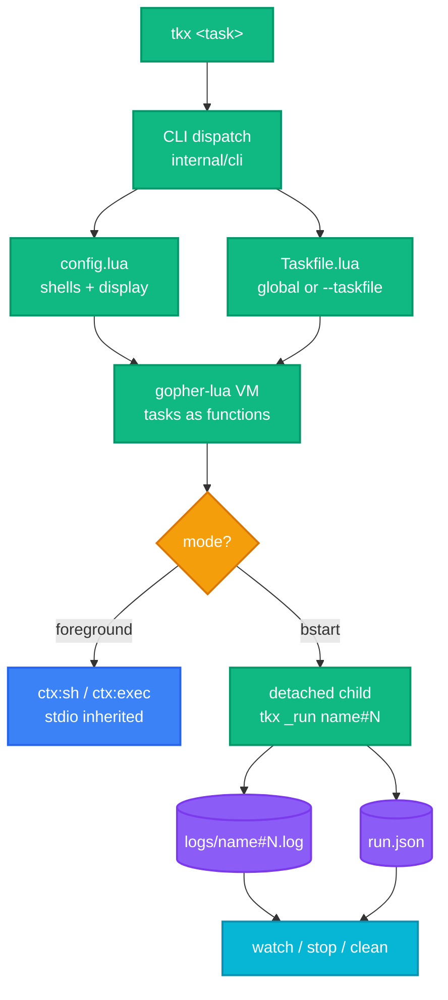

<div align="right">

[English](README.md) · [中文](README-zh.md)

</div>

<h1 align="center">tkx</h1>

<p align="center">
  <strong>A modern task runner with Lua taskfiles and built-in background task management.</strong>
  <br />
  <em>Real code over YAML · Global tasks · Detached background jobs</em>
</p>

<p align="center">
  <a href="#quick-start"></a>
  <a href="docs/lua.md"></a>
  <a href="LICENSE"></a>
</p>

<p align="center">
  <a href="https://github.com/XiaTian-AC/taskx/releases"></a>
  <a href="https://github.com/XiaTian-AC/taskx/actions/workflows/release.yml"></a>
  <a href="LICENSE"></a>
</p>

<p align="center">
  
  
  
</p>

---

## Why tkx?

- ⚡ **Tasks are real code** — `Taskfile.lua` tasks are Lua functions with conditionals, parameters, and inter-task calls. No YAML gymnastics.
- 🌍 **Global tasks** — Define once in `~/.config/taskx/Taskfile.lua`, run from any directory.
- 🌙 **Background execution** — `tkx bstart` detaches a task from your terminal. Close the window, the job keeps running.
- 👀 **Live output** — `tkx watch` tails any background job's log in real time; Ctrl+C leaves the viewer without killing the job.
- 🔀 **Multi-instance with a safety gate** — Same task can run twice; tkx warns about conflicts and asks before launching.
- 🧩 **Shell registry** — Default pwsh on Windows, bash elsewhere. Register custom shells in `config.lua`, pick per-run with `--shell`.
- 📦 **Single binary** — One ~8 MB executable, zero runtime dependencies.

## Documentation

| Doc | What's inside |
|---|---|
| **[Taskfile Authoring Reference](docs/lua.md)** | Complete `ctx` API, `args` shape, task declaration forms, common patterns, debugging |
| [Design Spec](docs/superpowers/specs/2026-08-21-tkx-design.md) | Architecture decisions, background mechanism, shell model |
| [Example Taskfile](testdata/Taskfile.lua) | Runnable sample with args and OS branching |

## Quick Start

### Install

**Scoop** (Windows):

```powershell
scoop bucket add XiaTian-AC https://github.com/XiaTian-AC/XiaTian-AC-bucket
scoop install tkx
```

**Homebrew** (macOS/Linux):

```bash
brew tap XiaTian-AC/XiaTian-AC-bucket
brew install tkx
```

**From source:**

```bash
go install github.com/XiaTian-AC/taskx@latest
```

### Write your first Taskfile

Create `~/.config/taskx/Taskfile.lua`:

```lua
local tasks = {
  hello = function(ctx)
    ctx:echo("hello world")
  end,
}
return tasks
```

### Run

```powershell
tkx hello     # → hello world
tkx ls        # list all tasks
```

## Usage

### Tasks with arguments

Declared args get validated by tkx; unknown flags are rejected with the allowed list.

```lua
local tasks = {
  release = {
    desc = "test, commit, tag, push",
    args = {
      tag   = { type = "string", required = true, desc = "git tag, e.g. v0.1.2" },
      force = { type = "bool", required = false, desc = "force push" },
    },
    run = function(ctx, args)
      ctx:sh("go test ./...")
      ctx:exec("git", {"tag", args.tag})          -- no shell, no injection
      if args.force then
        ctx:sh("git push --force --tags")
      else
        ctx:sh("git push --tags")
      end
    end,
  },
}
return tasks
```

```powershell
tkx release --tag v0.1.2
tkx help release            # shows desc + typed arg list
```

### Background lifecycle

```powershell
tkx bstart dev-server       # detach; survives terminal close
tkx ls-running              # dev-server#1  pid 12345  running
tkx watch dev-server        # live tail; Ctrl+C exits viewer only
tkx stop dev-server         # kills the process tree
tkx clean --older-than=7d   # prune ended instances + logs
```

### Handy commands

```powershell
tkx config                  # dump effective config (display + shells)
tkx ls-running              # filtered by display.ls_running.time (default 1h)
tkx --taskfile .\dev\My.lua hello   # run from any Taskfile without touching global
tkx build --shell bash      # pick a registered shell for one run
```

## Architecture



## Configuration

Files live under the tkx config directory (`~/.config/taskx/` on Windows too, honoring `XDG_CONFIG_HOME`).

| File | Purpose |
|---|---|
| `Taskfile.lua` | Your global tasks. Must return a `tasks` table. |
| `config.lua` | Optional: custom shells + display preferences. |

`config.lua` options:

```lua
return {
  shells = {
    gitbash = "C:\\Program Files\\Git\\bin\\bash.exe",
    mysh    = "/opt/mytool/bin/mysh",
  },
  display = {
    ls_running = {
      time = "1h",          -- "0" running only · 30m/1h/2d/1w window for ended jobs
      running_first = true, -- running on top of ended
      newest_first = true,  -- newest first within each group
    },
  },
}
```

Inspect the effective values with `tkx config`. Full option reference: [Taskfile Authoring Reference](docs/lua.md).

## ctx API (excerpt)

Every task receives a `ctx`. Eight methods, all colon-called:

| Method | Behavior |
|---|---|
| `ctx:sh(cmd, opts?)` | Run through the resolved shell; non-zero exit raises a Lua error |
| `ctx:exec(name, args?)` | Run a binary directly — no shell, no injection |
| `ctx:run(name, args?)` | Call another task in the same file |
| `ctx:echo(...)` | Print to stdout |
| `ctx:ask(prompt, default?)` | Read a line; falls back to default when stdin is gone (background) |
| `ctx:cwd()` / `ctx:os()` | Working directory / `"windows"` \| `"linux"` \| `"darwin"` |

Environment variables: use Lua's built-in `os.getenv(name)`.

See [docs/lua.md](docs/lua.md) for the complete surface, `args` semantics, and safety notes.

## Project Structure

```
main.go                    entry point, delegates to internal/cli
internal/
├── cli/                   command dispatch (ls/bstart/watch/stop/clean/config…)
├── config/                XDG paths, config.lua loader, duration helpers
├── taskfile/              Taskfile.lua loader (function + table forms)
├── runtime/               ctx bindings: sh/exec/run/echo/ask/cwd/os
├── argparse/              generic --flag parser, strict spec validation
├── shell/                 shell resolution incl. Windows Git Bash detection
├── bg/                    registry, detached launcher, procs, watch
docs/lua.md                Taskfile authoring reference
testdata/Taskfile.lua      runnable example
integration/               end-to-end tests
.goreleaser.yaml           multi-platform release config
.scoop/ .brew/             package manager templates rendered by CI
```

## Tech Stack

| Layer | Choice |
|---|---|
| Core | Go 1.22+, standard library only |
| Task language | Lua 5.1 via [gopher-lua](https://github.com/yuin/gopher-lua) (embedded, no external runtime) |
| Releases | [GoReleaser](https://goreleaser.com) + GitHub Actions |
| Packaging | Scoop bucket + Homebrew tap, hashes updated automatically per tag |

## CI/CD

Pushing a `v*` tag runs the release pipeline: multi-platform builds (windows/linux/darwin × amd64/arm64), checksums, GitHub Release — then re-renders the Scoop manifest and Homebrew formula with fresh SHA256s and commits them to their buckets. See [.github/workflows/release.yml](.github/workflows/release.yml).

## Contributing

1. Fork the repository
2. Create a feature branch (`git checkout -b feature/amazing`)
3. Commit your changes (`git commit -m 'feat: add amazing feature'`)
4. Push to the branch (`git push origin feature/amazing`)
5. Open a Pull Request

Run tests locally: `go test ./...` and `go test -tags integration ./integration/`.

## License

[MIT](LICENSE)
